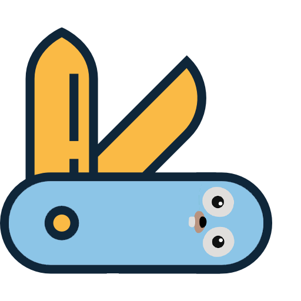

# kit

This package contains common packages used accross server based projects

# Packages included
* [goapp/cli](goapp/) - Go application package layout reference and cli supporting microservice workflow, DDD oriented with clean code/concerns separation (kubernetes, prometheus, twirp)
* [tx](tx/) - simple transactional abstraction
* [http](http/) - http server implementation with server lifecycle control, commonly used 
adapters, easy service registration and response/error handling, gracefull shutdown, tls support...
